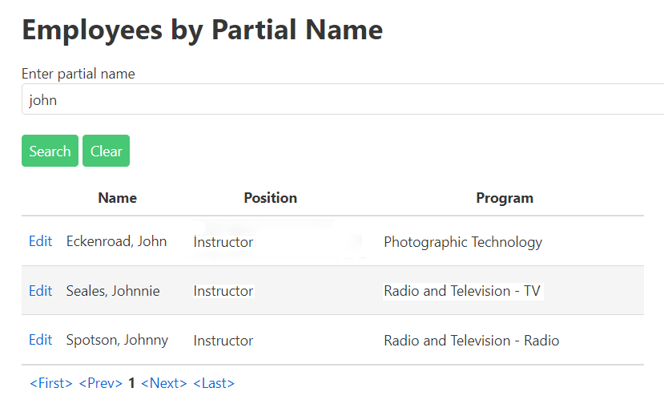

# A01: Employees

You must create two components (Query and CRUD) based on the following database tables. You will create the entities by using reverse engineering.


## Special NOTE:

When using the entity Program in variable declarations you **must** use the **fully qualified class name** as the datatype. Example: **MySystemName.Entities.Program** somepropertyname {get;set;}.  

Why? The web application project also has a class called Program. The system will get confused betweem the two if you do not use the fully qualified name.

## Query

> **Employees by Partial Name** - Search with Tabular Results 

Display the results of looking up Employees by a partial name string for active employees (non-released). The partial name string can be found in either the first or last name. The program and position names are to be used. Display the employee fullname, program and position. Follow the mock-up below as a guide to displaying the results. This mock-up demonstrates pagination. Remember you may also use tabular scrolling to limit the number of lines displayed.

**Future Deliverable Implementation Note**: Each employee line will contain a link to allow for record maintenance. This link will cause your CRUD component to appear. Add a separate New button to have your CRUD appear.

- **Search Filter:**



## CRUD

> **Employees** - Single Item Create/Read/Update/Delete

- Employees cannot be deleted. Employees are terminated. Employees have a nullable `ReleaseDate` which is set to indicate the employee is no long with the school.
- Include a not mapped property called FullName in the Employee entity definition. This property will return a string containing the string `LastName, Firstname` of the employee.
- Display must allow the user to select/view position and program from a list of data currently on the database.

**Queries**

Program List

Create a query that will return an ordered list of Programs by ProgramName.


Position List

Create a query that will return an ordered list of Positions by Description.


Employee by partial name

Create a query that will return an ordered (LastName then FirstName) list of Employees FullName. The query will receive a partialname string. Return the employees who process this string in either their first or last name.


Employee by ID

Create a query that will return an employee given an employee id.

**Entity Employee Entity**

Add the following to the entity for use in your application:

```csharp
[NotMapped]
public string FullName { get {return LastName + ", " + FirstName;}}
```

[Back to catalogue of scenarios](./ReadMe.md)
