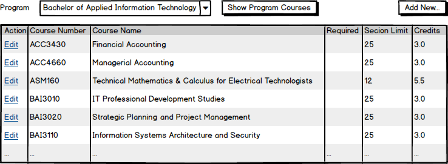

# A04: Program Courses

You must create two components (Query and CRUD) based on the following database tables. You will create the entities by using reverse engineering.

## Special NOTE:

When using the entity Program in variable declarations you **must** use the **fully qualified class name** as the datatype. Example: **MySystemName.Entities.Program** somepropertyname {get;set;}.  

Why? The web application project also has a class called Program. The system will get confused betweem the two if you do not use the fully qualified name.

## Query

> **ProgramCourses by Program** - Search with Tabular Results

Display the results of looking up ProgramCourses by Program. Ensure the drop-down has appropriate text as the first option to act as a prompt for the user. Follow the mock-up below as a guide to displaying the results. This mock-up demonstrates pagination. Remember you may also use tabular scrolling to limit the number of lines displayed.

**Future Deliverable Implementation Note:** Each program line will contain a link to allow for record maintenance. This link will cause your CRUD page to appear. Add a separate New button to have your CRUD appear.

## CRUD

> **ProgramCourses** - Single Item Create/Read/Update/Deactivate (Delete)

Note the following:

- `ProgramCourse` entries are **not** deleted. Rather than providing a "delete" button, inlude a "Deactivate" button and in the BLL method, change the `Active` flag to `false` and update the database for that entry.
- For entering the course number, use an `<select>` showing the results from a list.
- The Program should be displayed in a read-only drop down list. It should be display the program name.

  

**Queries**

Program List

Create a query that will return a list of programs ordered by the program name.

ProgramCourses for Program 

Create a query that will return a list of program courses ordered by the course name. Use of navigational properties will be required.  Select program courses that match a supplied program id. 

ProgramCourse by ID

Create a query that will return a program course given a program course id.

Courses List

Create a query that will return a list of courses ordered by the  course name.

[Back to catalogue of scenarios](./ReadMe.md)
