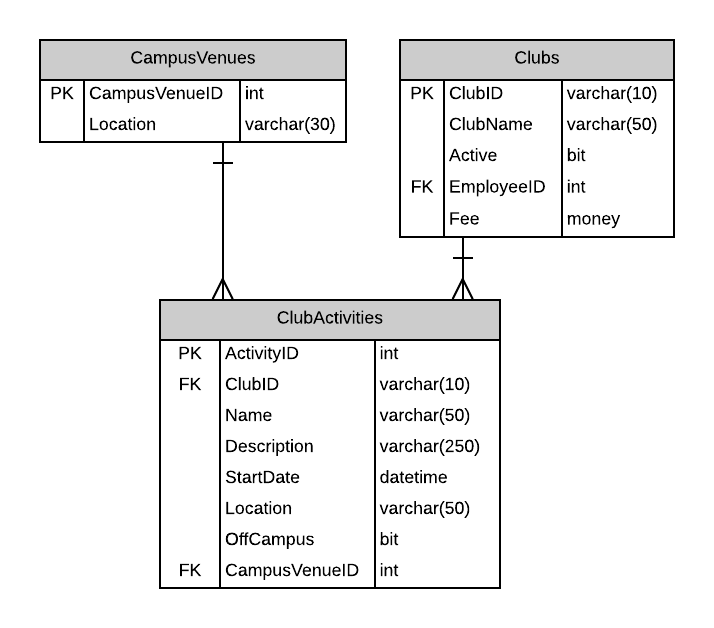
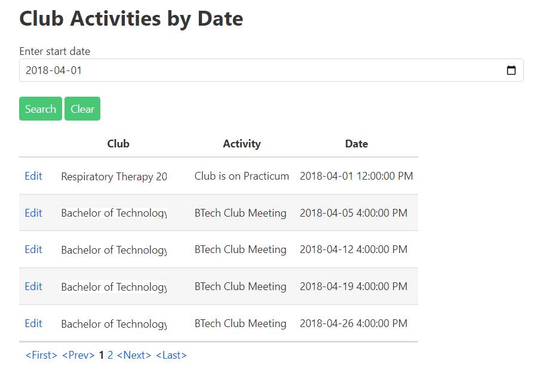

# A05: Club Activities

You must create two components (Query and CRUD) based on the following database tables. You will create the entities by using reverse engineering.

## Query

> **ClubActivities by Date** - Search with Tabular Resuits

Display the results of looking up Club Activities starting on or after the supplied start date. Show the Club, Activity name and its date (see mock-up below). The results will be displayed by start date. Restrict the date input control to accept only dates. This mock-up demonstrates pagination. Remember you may also use tabular scrolling to limit the number of lines displayed.

**Future Deliverable Implementation Note:** Add a selection column to each row for use during your CRUD processing. This link willl cause your CRUD component to appear.  Add a New button to go to your CRUD to add a new record.

## CRUD

> **ClubActivities** - Single Item Create/Read/Update/Delete

Note the following:

- Only future ClubActivities can be created, updated or deleted.
- ClubActivities' `StartDate` will default to Today if no start date is given when the activity is created.
- ClubActivities will have a CampusVenue assigned unless it is off campus. A CampusVenues  list can be obtained from the database. Off campus flag is off (False) and the Location is null. 
- Off campus activities must be flagged on (true) and have a `Location`. The CampusVenues will be null.
- The activity must be `either` a campus activity OR a off campus activity.
- 
**Queries**

Club List

Create a query that will return a list of Clubs ordered by the club name.

CampusVenus List

Create a query that will return a list of ClubVenues ordered by Location.

Club Activity List by start date

Create a query that will return a list of ClubActivities ordered by the Start Date. Selection of the activities is by a supplied start date. Activites are on or after the start date.

Club Activity by activity id

Create a query that will return a clubactivity that matches a supplied activityid.

[Back to catalogue of scenarios](./ReadMe.md)
